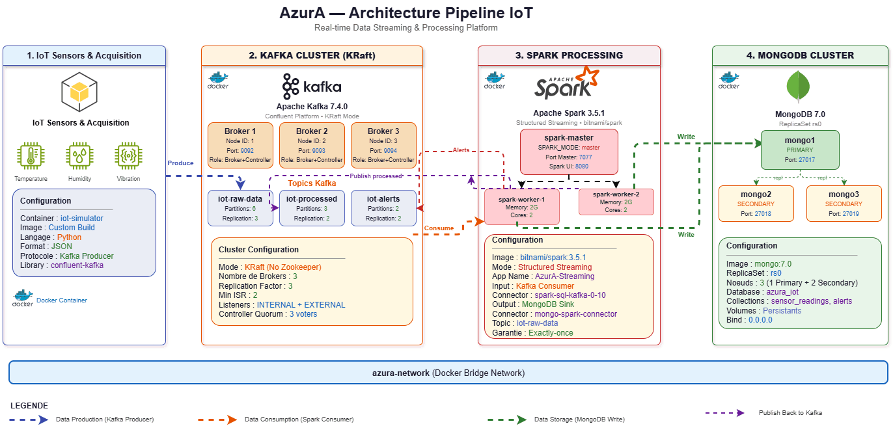

# AzurA : Plateforme Streaming IoT

Bienvenue sur le dépôt du projet AzurA. Ce projet est une plateforme complète et automatisée de traitement de données Big Data en temps réel pour l'Internet des Objets (IoT). 
Il permet de simuler, transporter, traiter et stocker des milliers de mesures industrielles par seconde, le tout avec une architecture professionnelle de haute disponibilité.



## Les Composants du Projet

L'architecture est entièrement conteneurisée via Docker et se divise en 3 grandes parties :

1. **Ingestion (Apache Kafka KRaft)** : Un script Python génère des données de capteurs virtuels (température, pression, etc.) et les publie en continu dans un cluster Kafka composé de 3 brokers (pour la tolérance aux pannes).
2. **Traitement Temps Réel (Apache Spark)** : Un cluster Spark Structured Streaming consomme les messages Kafka, décode le flux binaire en JSON, valide le schéma des données, et prépare l'écriture en continu (Micro-batching).
3. **Stockage Sécurisé (MongoDB)** : Les données traitées sont stockées dans une base MongoDB configurée en "Replica Set" à 3 nœuds. Si le serveur principal tombe en panne, un assistant prend le relais automatiquement sans perte de données.

## Comment Lancer le Projet

Grâce à notre configuration DevOps avancée, **l'intégralité de l'infrastructure démarre et se configure automatiquement** avec une seule commande !

### 1. Prérequis
- Docker et Docker Compose installés sur votre machine.
- Ports disponibles : `27017` (MongoDB), `9092` (Kafka), `8080` (Kafka UI).

### 2. Démarrage
Clonez le dépôt puis lancez la commande suivante à la racine du projet :
```bash
docker-compose up -d
```

### 3. Ce qui se passe en arrière-plan
Dès le lancement, les scripts d'initialisation vont s'exécuter d'eux-mêmes :
- Création automatique des topics Kafka (`iot-raw-data`, `iot-processed`, `iot-alerts`).
- Démarrage des générateurs de données IoT.
- Configuration automatique du cluster MongoDB (élection du Primary via `rs.initiate`).
- Mise en attente intelligente de Spark qui ne démarrera le traitement que lorsque MongoDB sera 100% prêt.

### 4. Vérification
Une fois le démarrage terminé, vous pouvez :
- Observer les flux de messages sur l'interface graphique **Kafka UI** accessible sur : `http://localhost:8080`
- Vérifier que les données sont bien enregistrées en temps réel dans la base de données :
```bash
docker exec -it mongo2 mongosh
> use azura_iot
> db.raw_measurements.countDocuments()
```
