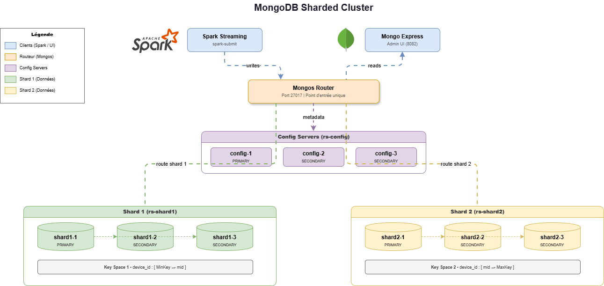

# AzurA : Plateforme Streaming IoT

Bienvenue sur le dépôt du projet AzurA. Ce projet est une plateforme complète et automatisée de traitement de données Big Data en temps réel pour l'Internet des Objets (IoT). 
Il permet de simuler, transporter, traiter et stocker des milliers de mesures industrielles par seconde, le tout avec une architecture professionnelle de haute disponibilité.


## Les Composants du Projet

L'architecture est entièrement conteneurisée via Docker et se divise en 3 grandes parties :

1. **Ingestion (Apache Kafka KRaft)** : Un script Python génère des données de capteurs virtuels (température, pression, etc.) et les publie en continu dans un cluster Kafka composé de 3 brokers (pour la tolérance aux pannes).
2. **Traitement Temps Réel (Apache Spark HA)** : Un cluster Spark Structured Streaming consomme les messages Kafka, décode le flux binaire en JSON, valide le schéma des données, et assure la haute disponibilité avec 2 Masters coordonnés par ZooKeeper.
3. **Stockage Distribué & Partitionné (MongoDB Sharded Cluster)** : Les données traitées sont stockées dans une architecture distribuée de pointe composée de 10 conteneurs (Config Servers, Mongos Router, et 2 Shards avec Replica Sets). Les données sont découpées et réparties à 50/50 grâce au *Hashed Sharding*.



## Comment Lancer le Projet

Grâce à notre configuration DevOps avancée, **l'intégralité de l'infrastructure démarre et se configure automatiquement** avec une seule commande !

### 1. Prérequis
- Docker et Docker Compose installés sur votre machine.
- Ports disponibles : `27017` (Mongos Router), `9092` (Kafka), `8080` (Kafka UI), `8082` (Mongo Express UI), `8081` / `8083` (Spark Masters UI).

### 2. Démarrage
Clonez le dépôt puis lancez la commande suivante à la racine du projet :
```bash
docker-compose up -d
```

### 3. Ce qui se passe en arrière-plan
Dès le lancement, les scripts d'initialisation vont s'exécuter d'eux-mêmes :
- Création automatique des topics Kafka (`iot-raw-data`, `iot-processed`, `iot-alerts`).
- Démarrage du cluster ZooKeeper et des 2 Masters Spark HA.
- Initialisation des Replica Sets MongoDB (`rs-config`, `rs-shard1`, `rs-shard2`).
- Enregistrement des Shards sur le routeur `mongos-router` et activation du Hashed Sharding sur la collection `raw_measurements`.
- Démarrage automatique du simulateur et du job Spark dès que la base est prête.

### 4. Vérification
Une fois le démarrage terminé, vous pouvez :
- Observer les flux de messages sur l'interface **Kafka UI** : `http://localhost:8080`
- Visualiser les données en temps réel sur **Mongo Express** : `http://localhost:8082`
- Vérifier le statut du Sharding et la répartition 50/50 sur le routeur :
```bash
docker exec -it mongos-router mongosh
> sh.status()
> use azura_iot
> db.raw_measurements.countDocuments()
```
