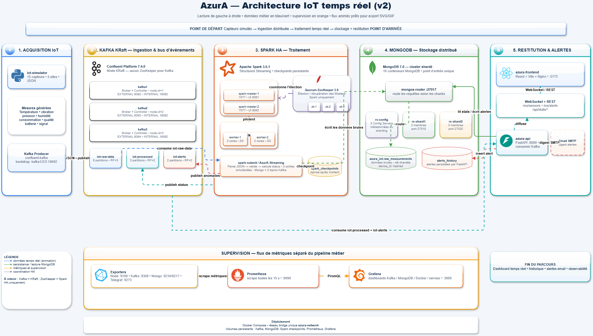
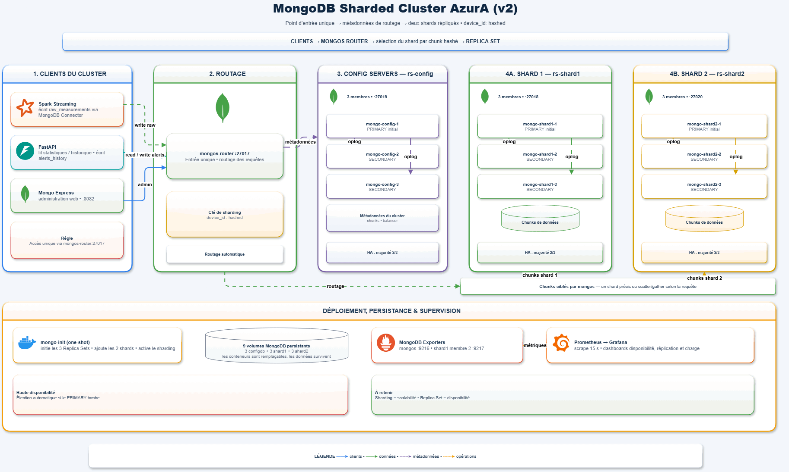

# industrial-iot-analytics — Plateforme de Streaming IoT Industriel en Temps Reel

> Plateforme Big Data complete pour la surveillance, le traitement et le stockage de donnees industrielles IoT en temps reel — concue avec une architecture de haute disponibilite professionnelle et un dashboard interactif.

---

## Vue d'Ensemble

**Azura industrial-iot-analytics** est une plateforme de streaming IoT industriel qui simule, transporte, traite et stocke des donnees de capteurs en temps reel. Le projet est inspire d'un scenario reel : la surveillance d'installations agricoles et industrielles au Maroc (Agadir, Dakhla, Kenitra, Tanger Med).

La plateforme repose sur cinq couches principales :

| Couche | Technologie | Role |
|--------|-------------|------|
| **Ingestion** | Apache Kafka (KRaft, 3 brokers) | Bus de messages distribue, tolerant aux pannes |
| **Traitement** | Apache Spark HA (2 Masters + ZooKeeper) | Streaming temps reel, detection d'anomalies dynamique |
| **Stockage** | MongoDB Sharded Cluster (10 conteneurs) | Persistance distribuee avec replication |
| **Supervision** | React + FastAPI + WebSockets | Dashboard temps reel, alertes, statistiques |
| **Monitoring** | Prometheus + Grafana + Telegraf | Metriques infrastructure et observabilite |

L'ensemble est conteneurise via **Docker Compose** (35 conteneurs) et demarre en une seule commande.

## Les Composants du Projet

L'architecture est entierement conteneurisee via Docker et se divise en 5 grandes parties :

1. **Ingestion (Apache Kafka KRaft)** : Un script Python genere des donnees de capteurs virtuels (temperature, pression, vibration, humidite, consommation) et les publie en continu dans un cluster Kafka compose de 3 brokers (pour la tolerance aux pannes).
2. **Traitement Temps Reel (Apache Spark HA)** : Un cluster Spark Structured Streaming consomme les messages Kafka, applique des seuils d'anomalies dynamiques (configurables depuis le dashboard), et assure la haute disponibilite avec 2 Masters coordonnes par ZooKeeper.
3. **Stockage Distribue & Partitionne (MongoDB Sharded Cluster)** : Les donnees brutes sont stockees dans une architecture distribuee composee de 10 conteneurs (Config Servers, Mongos Router, et 2 Shards avec Replica Sets). Les donnees sont decoupees et reparties a 50/50 grace au *Hashed Sharding*.
4. **Dashboard Interactif (React + FastAPI)** : Une application web complete avec tableau de bord temps reel (WebSockets), gestion des alertes par email, configuration des seuils, et statistiques historiques.
5. **Monitoring Infrastructure (Prometheus + Grafana)** : Stack d'observabilite complete avec exporters (Node, Kafka, MongoDB, Docker/Telegraf), Prometheus pour la collecte, et Grafana pour la visualisation.

---

## Architecture Globale du Pipeline



---

## Architecture Detaillee par Couche

### Couche — Simulation IoT (Ingestion)

Le simulateur Python genere des lectures realistes pour **20 capteurs physiques** repartis sur **4 sites** au Maroc.

#### Les 5 Types de Capteurs

| Type | Unite | Plage Normale | Fabricant |
|------|-------|---------------|-----------|
| `temperature` | degC | 20 - 80 | Siemens Maroc (TH-200X) |
| `vibration` | mm/s | 0 - 5 | Fluke (VB-805) |
| `pression` | bar | 1 - 10 | Bosch (PR-3000) |
| `humidite` | % | 30 - 70 | Honeywell (HM-40) |
| `consommation` | kW | 100 - 500 | Schneider Electric (PM-5000) |

#### Les 20 Capteurs Actifs (4 zones x 5 types)

```
Zone 1 : Agadir (Serre Agricole)       --> sensor_temp_001, sensor_vib_001, sensor_pres_001, sensor_hum_001, sensor_pow_001
Zone 2 : Dakhla (Station Emballage)    --> sensor_temp_002, sensor_vib_002, sensor_pres_002, sensor_hum_002, sensor_pow_002
Zone 3 : Kenitra (Station Filtrage)    --> sensor_temp_003, sensor_vib_003, sensor_pres_003, sensor_hum_003, sensor_pow_003
Zone 4 : Tanger Med (Hub Logistique)   --> sensor_temp_004, sensor_vib_004, sensor_pres_004, sensor_hum_004, sensor_pow_004
```

Chaque capteur transmet une mesure toutes les **2 secondes** avec des metadonnees completes (coordonnees GPS, niveau batterie, qualite du signal, firmware).

---

### Couche — MongoDB Sharded Cluster (Stockage Distribue)



MongoDB stocke **uniquement les donnees brutes** (telles qu'elles arrivent de Kafka, sans enrichissement). C'est un **Data Lake** immuable.

---

### Couche — Dashboard Interactif (React + FastAPI)

L'application web offre 4 pages principales :

| Page | Fonctionnalite |
|------|----------------|
| **Capteurs** | Tableau de bord temps reel des 20 capteurs via WebSocket, carte geographique interactive (Leaflet) |
| **Alertes** | Flux d'anomalies en direct, historique des alertes, notifications par cloche |
| **Statistiques** | Graphiques historiques, KPIs, sante batterie, metriques physiques par site |
| **Reglages** | Configuration des seuils d'anomalies, gestion securisee des emails (OTP), test SMTP |

Le backend FastAPI communique avec Kafka (consommation temps reel), MongoDB (historique) et le frontend via **WebSockets** pour un affichage instantane sans polling.

---

## Interfaces de Monitoring & Supervision

Une fois le projet demarre, les interfaces suivantes sont accessibles :

| Interface | URL | Description |
|-----------|-----|-------------|
| **AzurA Dashboard** | http://localhost:5173 | Dashboard React temps reel (capteurs, alertes, statistiques) |
| **AzurA API** | http://localhost:8000 | API REST FastAPI + WebSockets |
| **Grafana** | http://localhost:3000 | Dashboards visuels (Sante VM, Conteneurs, Kafka, MongoDB) |
| **Prometheus** | http://localhost:9090 | Collecte des metriques systeme et applicatives (PromQL) |
| **Kafka UI** | http://localhost:8080 | Visualiser les topics, messages, consommateurs |
| **Mongo Express** | http://localhost:8082 | Explorer la base `azura_iot` en temps reel |
| **Spark Master 1 UI** | http://localhost:8081 | Statut du Master Spark actif |
| **Spark Master 2 UI** | http://localhost:8083 | Statut du Master Spark standby |
| **Spark Driver UI** | http://localhost:4040 | Suivi du job `stream_processor.py` en cours |

---

## Guide de Demarrage en Local

### Prerequis

- **Docker Desktop** installe et demarre (version 20.10+)
- **Docker Compose** v2+ (inclus dans Docker Desktop)
- **RAM disponible** : minimum 8 Go recommandes (MongoDB + Spark sont intensifs)
- **Ports libres** : `5173`, `8000`, `8080`, `8081`, `8082`, `8083`, `4040`, `3000`, `9090`, `9092`, `27017`

### Etape 1 — Cloner le depot

```bash
git clone <url-du-repo>
cd stage_AzurA
```

### Etape 2 — Configurer les variables d'environnement

```bash
cp .env.example .env
```

Editez le fichier `.env` et renseignez vos valeurs reelles (credentials SMTP pour les notifications email, IP de votre VM si applicable). Le fichier `.env.example` contient un modele avec des valeurs fictives.

### Etape 3 — Demarrer l'infrastructure complete

```bash
docker-compose up -d
```

Cette commande demarre **35 conteneurs** et declenche automatiquement les scripts d'initialisation.

### Etape 4 — Verifier le demarrage (environ 60 a 90 secondes)

Surveiller les logs des services critiques :

```bash
# Verifier que le cluster MongoDB s'est initialise
docker logs mongo-init --follow

# Verifier que les topics Kafka ont ete crees
docker logs kafka-init --follow

# Verifier que le simulateur IoT publie des messages
docker logs iot-simulator --follow

# Verifier que Spark a soumis le job
docker logs spark-submit --follow
```

### Etape 5 — Verification du Pipeline en Temps Reel

**a) Ouvrir le Dashboard AzurA :**

Acceder a http://localhost:5173 pour voir le tableau de bord temps reel avec les donnees des capteurs et les alertes.

**b) Confirmer que des messages arrivent dans Kafka :**

Ouvrir http://localhost:8080 -> onglet "Topics" -> cliquer sur `iot-raw-data` -> "Messages".

**c) Confirmer que les donnees sont stockees dans MongoDB :**

```bash
# Se connecter au routeur Mongos
docker exec -it mongos-router mongosh

# Dans le shell MongoDB
use azura_iot
db.raw_measurements.countDocuments()   # Doit augmenter avec le temps
db.raw_measurements.findOne()          # Voir un document exemple
sh.status()                            # Verifier la repartition du sharding
```

**d) Confirmer les alertes dans le topic Kafka :**

Ouvrir http://localhost:8080 -> topic `iot-alerts` -> observer les messages (apparaissent apres ~60s, lorsque les pannes simulees demarrent).

### Etape 6 — Arreter le projet

```bash
# Arreter tous les conteneurs (les donnees sont conservees dans les volumes)
docker-compose down

# Arreter ET supprimer toutes les donnees (volumes inclus)
docker-compose down -v
```

### Depannage Rapide

| Symptome | Cause probable | Solution |
|----------|----------------|----------|
| `mongo-init` en erreur | Mongos pas encore pret | Attendre 30s et relancer `docker-compose up -d mongo-init` |
| Pas de messages dans `iot-raw-data` | `kafka-init` incomplet | `docker logs kafka-init` pour voir les erreurs |
| `spark-submit` redemarre en boucle | Masters Spark pas encore ACTIVE | Attendre 30 a 60s supplementaires |
| Mongo Express inaccessible | `mongo-init` pas encore termine | `docker logs mongo-init` et attendre |
| Dashboard AzurA vide | `azura-api` pas connecte a Kafka | `docker logs azura-api` et attendre 15s |

---

## Licence

Ce projet est sous licence **MIT** © 2026 Mohamed Boufous.
